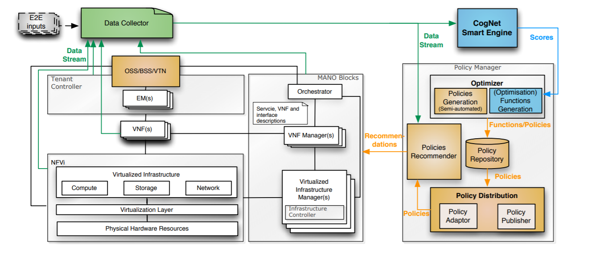

# CogNet

## Introduzione 
Dato che con la quinta generazioni di reti mobili (5G) ci si aspetta che vengano supportate sia comunicazioni tra umani che tra macchine e connessioni di un gran numero di dispositivi tramite un ampio flusso di informazioni, nasce la necessità di riuscire a gestire la rete tramite una buona  organizzazione, configurazione, sicurezza e ottimizazione della stessa.

CogNet è un progetto che ha lo scopo di fornire un livello più elevato e più intelligente di gestione della rete per poter garantire la [Quality Of Service](https://it.wikipedia.org/wiki/Qualit%C3%A0_del_servizio) (QoS), migliorare l'efficienza e ridurre le spese operative delle reti 5G. L'idea è quindi quella di raggiungere una gestione automatizzata delle infrastrutture di rete delle tecolecomunicazioni tramite la tecnologia del Machine Learning.

## Architettura
CogNet propone di estendere la già esistente architettura [NFV](https://en.wikipedia.org/wiki/Network_function_virtualization) (Network Functions virtualization) che sfrutta le tecnologie IT per virtualizzare intere classi di funzioni dei nodi di rete come blocchi elementari e che possono essere interconnessi per implementare servizi di comunicazione.
Nell'architettura CogNet, mostrata in Figura 1, le risorse hardware sono gestite in un'architettura a strati, in particolare le informazioni di stato e di consumo delle risorse hardware sono raccolti in tempo reale da più blocchi funzionali che costituiscono l'architettura a più livelli.
I dati raccolti verrebbero poi elaborati da CogNet Smart Engine (CSE) in tempo (quasi) reale o periodicamente, fondamentale per la gestione della rete 5G poiché mira a fornire una risposta immediata ad ogni cambiamento.
Il Policy Manager è invece quello strato che, grazie alle informazioni in uscita dal CSE, genera le politiche di controllo successivamente distribuite alle risorse hardware e ai relativi componenti di gestione richiamando le API correlate. 

L'architettura di alto livello di CogNet include l'architettura NFV la quale deve inoltrare costantemente i record di stato e di utilizzo al CSE.
Il CSE analizza quindi i dati raccolti per vari scopi come la scelta di allocazione dinamica delle risorse in base alle previsioni della richiesta di ognuna di esse e il rilevamento di minacce alla sicurezza o di degrado delle prestazioni.
L'output del CSE è costituito da valori che permettono al Policy Manager di generare le policy, il quale, non solo traduce le regole del CSE in politiche, ma ne raccomanda anche delle altre all'architettura NFV.

## Big Data
L'obiettivo proposto per l'architettura CogNet può essere raggiunto applicando gli algoritmi di Machine Learning alla gestione della rete, ma questo dovrà avvenire su enormi quantità di dati e da una varietà di fonti di dati basate sull'esperienza attuale delle reti 4G. 
La sfida sulla gestione dei big data sarà aggravata nelle reti 5G, pertanto quando si progetta un architettura CogNet è necessario considerare le caratteristiche dei big data che sono il volume, la velocità, la varietà e la loro veridicità.

# My First e-Book

You can write a general introduction here.
I am writing this document using [MarkDown](http://it.wikipedia.org/wiki/Markdown) language and compiling it in many forms using [Pandoc](http://pandoc.org)

## Sub-section about something

Bla bla bla.

In the gim I do:
* weights raise
* running
* push-up
